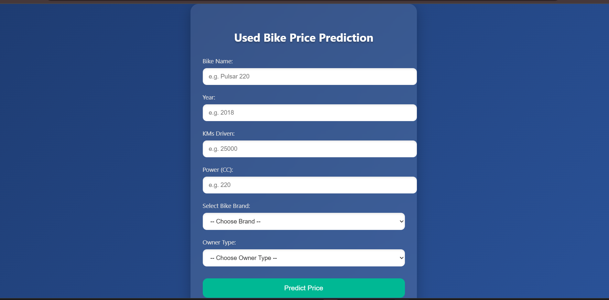

# 🚲 Used Bike Price Prediction App

This project is a Flask-based web application that predicts the **price of a used bike** based on various input features. The model is trained using machine learning algorithms on real-world bike data.

---
## 🔍 Features

- 📊 ML Model: **Random Forest Regressor**
- 🧠 Trained pipeline with preprocessing (scaling)
- 🧪 Development done in Jupyter Notebook
- 🌐 Flask web interface for real-time predictions
- 🎨 Styled with HTML, CSS

---


## 📊 Model Performance

The best-performing model is **Random Forest Regressor**.

| Metric                | Random Forest        | Decision Tree        | XGBoost             |
|----------------------|----------------------|----------------------|---------------------|
| **Training R²**      | 0.9936               | 0.9980               | 0.9909              |
| **Test R²**          | 0.9534               | 0.9457               | 0.9522              |
| **Test MAE**         | 3661.34              | 3807.09              | 4005.94             |
| **Test RMSE**        | 17452.30             | 18837.96             | 17688.15            |

---

## 💻 App Screenshots

### 🔹 Home Page


### 🔹 Prediction Result


---

## 📁 Project Structure

Use_bike_price_prediction/
│
├── app.py
├── bike.ipynb
├── model/
│ ├── scaler.pkl
│ └── usebike_model_fixed.pkl
│
├── static/
│ ├── bike.png
│ ├── loading.css
│ ├── result.css
│ └── style.css
│
├── templates/
│ ├── index.html
│ ├── loading.html
│ └── result.html
│
└── README.md

---

## 📦 Requirements

Install dependencies with:

```bash
pip install -r requirements.txt

📚 Dataset
Source: Used Bike Dataset kaggle :-https://www.kaggle.com/code/amalmm227/used-bikes-price-prediction-2022

🚀 How to Run

```bash
python app.py


Then open your browser and go to:

```
http://127.0.0.1:5000/
```


🔒 License
This project is open-source and available under the MIT License.


## 📬 Contact

For questions or feedback, email: **sahejkadam0@gmail.com**

---

> ⭐ Star this repo if it helped you!


